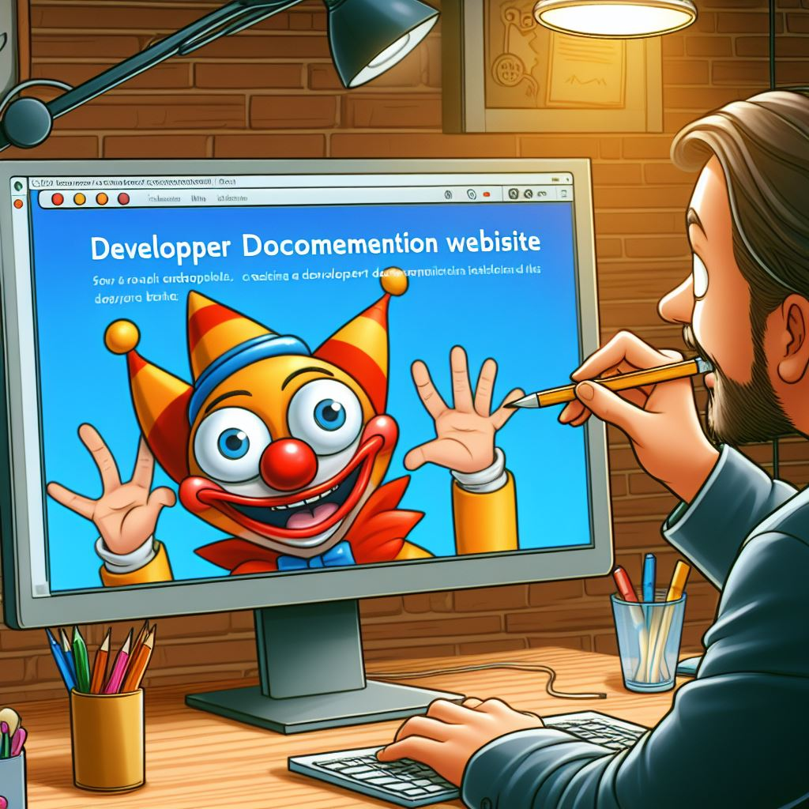

I recently joined Algolia as Senior Program Manager for DocSearch (and other programs too). I'm a firm believer that hands on experience is the ultimate way to increase knowhow and as program manager for DocSearch, that's the first thing I wanted to do. So, this blog will detail the process I went through as a complete newcomer to DocSearch. As an added bonus, this site is also going to serve as the actual input for the DocSearch I create! As I go, I will be able to create more content, which will require me to learn more about DocSearch, which will require me to write more about it. Win win!

Short bio - went to school for computer engineering, focused on JAVA for my first few professional years, switched jobs, maintained an internal website based on PHP for the QA team of a C++ application. Lots of C++, Python, PHP/C#, more JAVA, and years later, I started doing more management than coding. Following that while part of a technical sales team, I coded more at the desktop UI level with MFC/WPF/.NET to show developers how to implement C++ libraries for the desktop. After that came a long string of more managerial/director roles that, while I had to manage technical people, kept me from doing technical things for most the time. So while I have a pretty deep technical knowledge pool to pull from, I've been out of the game for awhile. All the latest web tech stack stuff is pretty new to me in terms of hands-on. 

Come with me to implement DocSearch on a new doc site.

# The rough overall approach

Before I went too far, I thought it would be good to make an outline of what I was trying to acheive:

* Create a developer doc site
* Create a DocSearch application with index
* Implement a frontend UI for searching the index
* Make updates to the doc site
* Update the index
* See the changes reflected in the UI
* Improve the process overall as I learn more
** Refine index and utilize more Algolia features as I go
** Refine the search UI experience

# Deploy a doc site

My first inclination was to create a website based on Hugo. The reason I thought of Hugo was that I knew it had a big supportive community and thought that could be a good place to start. Keep in mind that, while I 