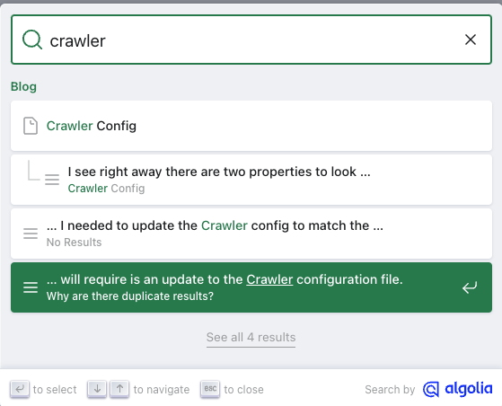
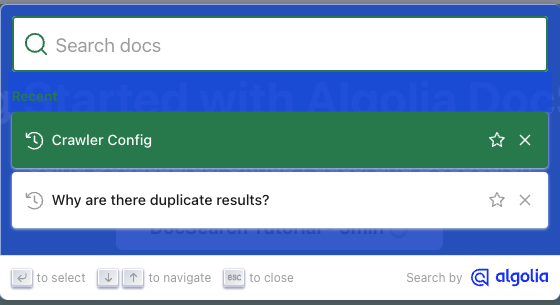

# UI Styling

At this point everything is working as expected, as far as I can tell. Just to recap at a VERY high level:

* Deployed a Docusaurus site
* Applied for DocSearch
* Updated DocSearch config
* Excluded some URLs

Great, looking back, actually its not all that difficult, but there is a little learning curve to anything new. Now I want to better understand how to influence the styling of the UI on the page while I'm performing a search. To give myself something to aim at, I'm going to update each of my blogs with an image that represents the blog post and have the results pull up that image.

<!--truncate-->

# Blog Image

I'm not quite sure how to do this and I'm writing this as I go. My first thought was to put an image at the top of each blog, probably in a container that I can then reference with the crawler config/selector. While looking at the Docusaurus docs, I saw that Blogs have a property in the frontmatter called <code>image</code> and the definition appears to be "Cover or thumbnail image that will be used when displaying the link to your post.". This seems more desireable at the moment. My thinking is that I can attach an image to the blog without requiring it to be <i>in</i> the blog. But now that I'm typing this out, maybe that doesn't make sense becuase then the person will reach the page and not see the image. Still, I want to expirement with it some, so that's what I'm going to start with.

As such, I've downloaded an image for each blog post so far, specified the property with the proper image name, and redeployed the changes. While I see the images in the page source, those images don't seem to appear when I do something like paste a link to the blog in slack. In addition, I then made them the <code>og:image</code> thinking that would do it but I'm still not seeing it work. In fact, now that I've specified them as <code>og:image</code> I'm seeing that Docusaurus isn't copying the images over into the asset folder as expected. Well, for now, I'm going to put this image thing on ice. What I want to do next is just influence the styling of the UI window a little.

# UI Styling Part Two

The Docusaurus docs on the Algolia search integration contains some information on styling that can be used OOTB (https://docusaurus.io/docs/search#connecting-algolia), so I'm going to try that first. Now that I look at it closer, I see what has been done is just providing you the values that you can more easily override, if you want to. Just to do some testing, I changed the background color to something very obvious, to be sure the change made an impact.

## Before

## After

This change was reverted. :/

That's all for today...